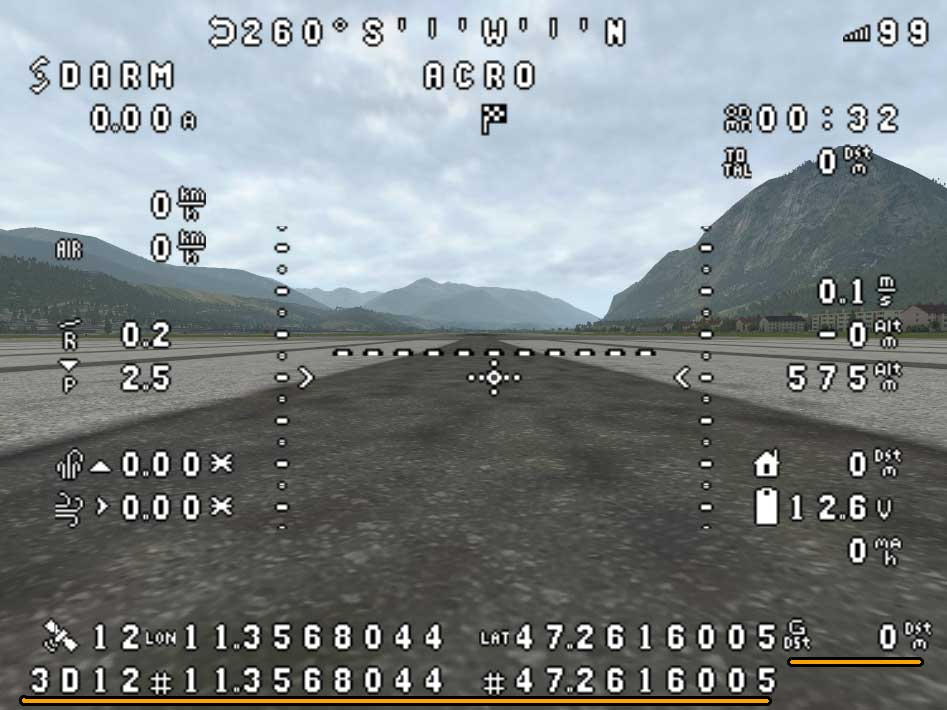

> [!CAUTION]
> # ***** WORK IN PROGRESS!!!! ****

# Опис

Відео демонстрація:

[](https://www.youtube.com/watch?v=MiOdIXQ3F5w)

На цьому ресурсі викладено модифіковану прошивку INAV 7.0 з можливістю навігаціі за умов відсутності GPS.
Працює лише на літаках.
Основна мета модифікації - **повернення літака домому в умовах втрати сигналів керування та GPS**.


Літак повинен бути обладнаний датчиками:
- **акселерометр, гіроскоп**
- **барометр**
- **GPS**
- **компас (обовязково для забезпечення точності навігації, але є варіанти, див. опис нижче)**
- *трубка піто* (не обов'язково)


Офіційна прошивка INAV **відключає всі навігаційні режими** при втраті GPS сигналу. При польотах над недоступною місцевістю, втрата сигналу керування означає втрату літака, оскільки літак може лише або продовжувати безконтрольно летіти, або приземлитися.

Модифікована прошивка дозволяє повернути літак, вікористовуючи лише компас і барометр (або тільки барометр).

Треба наголосити, що прошивка **не є рішенням для виконання місій в умовах повної відсутності GPS**. Якщо повернення додому з похибкою +-2км для відновлення сигналу керування є нормальним, то виконання місій з такою похибкою навряд чи є доцільним.

При використанні компасу, в реальних умовах похибка складає до 200м на 1 км шляху. 

Без компасу літак може полетіти в будь-якому напрямку, дивись опис нижче!

***На відміну від версіі з inav 6.0, ця версія включає естимацію не лише при втраті супутників, але й при апаратній проблемі GPS сенсору.***


# Завантаження

### Версія: 1.0

#### Прошивка
Прошивку можна завантажити тут https://github.com/RomanLut/inav/tree/7.0.0_gps_fix_estimation/firmware

або самостійно зібрати з branch https://github.com/RomanLut/inav/tree/7.0.0_gps_fix_estimation

*Перехід з будь-якої іншої прошивки треба здійснювати через **Ful Chip Ease***

#### Конфігуратор

Конфігуратор можна завантажити тут https://github.com/RomanLut/inav-configurator/tree/7.0.0_gps_fix_estimation/apps

або самостійно зібрати з branch https://github.com/RomanLut/inav-configurator/tree/7.0.0_gps_fix_estimation

*(файли прошивод прошивок потрібно завантажувати локально і використовувати **[Load Loacal Firmware]***)*


### Історія змін

* **1.0 ======**

Перший реліз на основі inav 7.0.

Основні відмінності від офіційної версії inav 7.0:

- додана можливість навігації за умов відсутності GPS fix, можливість примусово відключати датчик GPS з пульту
- додана підтримка Lowrace Band(6), додана можливість нанаштування сітки частот Band 5, Band 6
- **RC_CHANNEL_OVERRIDE** в progamming можуть керувати **Roll**, **Pitch**, **Yaw**, **Throltle** каналами в режимі **Failsafe**
- ```nav_rth_abort_threshold=0``` та ```nav_disarm_on_landing= off``` встановлені за замовчуванням.
- включає деякі виправлення SITL
- custom target MATEKF405TE_SD_S9_S10_PINIO3_PINIO4 ( S9 та S10 перероблені в PINIO3, PINIO4 ).

Конфігуратор включає:
- виправлення встановлення Default settings https://github.com/iNavFlight/inav-configurator/pull/1922
- операцію **Disable GPS Fix** в Programming
- можливість вибирати Lowrace Band
- SITL з виправленнями (для Windows та Linux, але без MacOs).
    
# Як це працює ?

За нормальних умов, літак отримує своє положення від датчика GPS, що надає йому можливість здійснювати навігацію згідно маршруту.

За відсутності GPS, літак має інформацію лише про напрямок польоту (від компасу).

Припустивши, що в навігаційних режимах літак рухається з постійною або відомою (airspeed sensor) швидкістю, є можливість вираховувати нові координати, використовуючи останні відомі координати, напрямок і швидкість (так званий метод навігації "**dead reconing**").

Але така навігація не є точною. З часом накопичується істотна похибка. 

Припускається, що літак почне повернення з деяким відхиленням від курсу, після чого сигнали GPS або керування відновляться.

Реалізовано два режими:

```set inav_allow_gps_fix_estimation = ON``` Первинно літак повинен отримати GPS fix і запям'ятати точку повернення. Тобто зліт в умовах повної відсутності GPS неможливий.

```set inav_allow_gps_fix_estimation = ON_SAFE_HOME``` Естимація працює з самого початку. Точкою відліку вважається **safehome 0** (можливий зліт в умовах повної відсутності GPS).

# Навігація без компасу

**Не рекомендується використовувати навігацію без компасу окрім випадку включення RTH через декілька секунд після втрати GPS Fix.**

Літак має можливість вираховувати напрямок на північ в перші секунди польоту, коли працює GPS. При відсутності компасу, напрямок на північ перераховується, використовуючи останній відомий напрямок та кутову швидкість(гіроскоп). Нажаль, похибка накопичується доволі швидко. В реальних умовах, вже через одну хвилину польоту, напрямок може бути спотворений на 45 градусів! 

Якщо є потреба забезпечити, что б літак ні в якому разі не сідав при втраті керування та GPS - це працює. Але точність навігаціі ніяк не забезпечується без компасу! Можна використувувати, лише розуміючи ризик - у разі втрати керування літак може полетіти в будь-якому напрямку!

В режимі **ON_SAFE_HOME** літак може взагалі ніколи не отримати GPS координати з сенсору. В цьому випадку напрямок на північ - напрямок носу літака в момент під'єднання батареї.

Таким чином, в самому екстремальному випадку, літак може бути обладнаний лише барометром. GPS сенсор повинен бути включений в конфігурації, але не встановлений фізично. Літак  буде мати режим Cruise та буде намагатися повернутись додому, але, скоріш за все, полетить в неправильному напрямку.

# Можливі сетапи

## Літак обладнаний GPS, Baro, Compass, Pitot
В реальних умовах похибка навігації при відсутності GPS складає до 200м на 1 км шляху. Похибка залежить від вітру, але може буде знижена, ящко дати літаку вирахувати швидкість и напрямок вітру (див. далі).

Відео демонструє роботу системи в реальних умовах. GPS сенсор відключається примусово час від часу.
Пурпурна лінія - естимована позиція. Чорна лінія - реальне положення літака.

https://github.com/RomanLut/inav/assets/11955117/0599a3c3-df06-4d40-a32a-4d8f96140592

## Літак обладнаний GPS, Baro, Compass
Дещо збільшена(але  прийнятна) похибка відносно першої конфігурації. Cruise Throttle override збільшує похибку.

## Літак обладнаний Baro та Compass. GPS сенсор включений в конфігурації, але не встановлений фізично
Польоти при повній відсутности GPS сигналу. Точність навігації достатня, щоб в разі RTH повернути літак в напрямку дому, але точка приземлення може відрізнятися доволі суттєво і сильно залежить від вітру (може долетіти або перелетіти).

## Літак обладнаний GPS, Baro
Похибка навігації при відсутності GPS накопичується дуже швидко через спотворення напрямку на північ. Похибка нижче при прямолінійному польоті. Такий сетап можна використосувати лише за умов негайного включення RTH при втраті GPS сигналу. Літак може доволі точно повернути, націлитись на дім і здійснити прямолінійне поверння. Якщо намагатися літати з втраченим GPS, напрямок на північ спотвориться вже через хвилину, і в разі RTH літак полетить в неправильному напрямку.

Пурпурна лінія - естимована позиція. Чорна лінія - реальне положення літака.


## Літак обладнаний лише Baro. GPS сенсор включений в конфігурації, але не встановлений фізично
Польоти при повній відсутности GPS сигналу. Похибка навігації накопичується дуже швидко через спотворення напрямку на північ. Такий сетап будет мати режим Cruize(який не буде відрізнятися від angle+althold), буде летіти в кудись разі RTH (а не буде включати Emergency landing), але нарямок польоту RTH будет неправильний (надія лише на відновлення сигналу керування).

# Налаштування

Включення навігації без GPS виконується командою CLI:

```set inav_allow_gps_fix_estimation = ON```

або 

```set inav_allow_gps_fix_estimation = ON_SAFE_HOME```

Якщо не встановлена трубка Піто, то дуже важливо якомога точніше вказати швидкісь літака в режимі CRUZ. Для цього потрібно вивести швидкість на OSD і здійснити тестовий політ. Щоб мінімізувати вплив вітру, потрібно здійснити польоти в протилежних напрямках і вирахувати середнє.

Швидкіть потрібно вказати в см/с. 

Щоб перевести з км/г до см/с, потрібно домножити на 27.77.

Наприклад, 100 км/г = 100 * 27.77 = 2777 см/с

```set fw_reference_airspeed = 2777```

*Важливо, щоб в умовах втрати GPS літак летів з вказаною швидкістю. Якщо у вас налаштовано збільшення Cruise Throttle за допомогою стіку, не використовуйте це в моменти відсутності GPS.*

*Але якщо встановлена трубка піто, швидкість буде вираховуватись з даних від трубки піто. Точність навігації підвищиться. Також можна використовувати Cruise throttle override без зниження точності*.


Якщо є потреба виконувати місії без сигналу GPS, вводимо:

```failsafe_gps_fix_estimation_delay = -1```

Якщо є потреба виконувати місії без сигналу керування, вводимо:

```set failsafe_mission_delay = -1```

**Після введення команд, важливо зберегти налаштування командою:**

```save```

# Місії в режимі естимації

```set failsafe_gps_fix_estimation_delay = -1```

Параметр задає, через скільки секунд буде активована процедура RTH, якщо сигнал GPS втрачено при виконанні місії. Значення в діапазоні 7..600, або -1. Якщо задано -1 - RTH не буде включатись. Це налаштуванян працює незалежно від втрати сигналу керування (опція ```failsafe_mission_delay```).


# Режим ON_SAFE_HOME

В режимі **ON_SAFE_HOME** естимація включається відразу після під'єднання батареї. Точкою відліку вважаєтья **safehome 0** (назалежно від факту, включений **safehome 0**, чи ні).

Координати **safehome 0** задаються командою cli:

```safehome 0 1 lon lat```

де lon та lat - координати * 10 000 000. Наприклад: ```49.53997 30.645540183584494``` => ```495399700 306455401```

Подробиці див. https://github.com/RomanLut/inav/blob/7.0.0_gps_fix_estimation/docs/Safehomes.md

*За замовчування координати safehome - 0,0. Можна злетіти з відлюченим GPS в режимі ON_SAFE_HOME, в цьому випадку літак буде вважати, що літає десь біля екватору і буде повертатись теж в точку 0,0. Однак, якщо літак отримає реальні координати з сенсору (і сенсор буде включений), він опиниться за сотні кілометрів від зафіксованої точки дому (0,0) та в разі RTH буде повертатись кудись на південь. В любому випадку, краще встановити **safehome 0** в якусь точку на північ від реальноі позиції зльоту, щоб літак повертався ні північ.*

***В загальному випадку, пілот повинен свідомо застосовувати існуючі можливості, використувуючи наявну функціональнісь: систему навігації без GPS, можливість відключати GPS сенсор, систему Safe Homes, можливість скидання точки дому з пульту (Home reset BOX). Для оцінки ситуації потрібно як мінімум викорисовувати елементи OSD: Distance To Home, Direction to home та Glide range.***

# Відключення датчика GPS з пульта керування або Programming

 

 

Ця можливість може використовуватись:
- для тестування навігації без GPS
- для навмисного відключення GPS в умовах GPS спуфінгу

*Операція **Disable GPS fix** в Programming недоступна в офіційному релізі конфігуратора*

*Режим ```set inav_allow_gps_fix_estimation = ON```: Відключення працює після того, я літак знайде супутники і зафіксує точку повернення, і лише в режимі ARM.*

*Важливо: якщо GPS координати вже спотворені GPS спуфінгом, неможна використовувати автоматичне повернення додому. Відключення треба робити заздалегіть. При спотворенні GPS координат потрібно вийти з зони спуфінгу на ручному керуванні, отримати правильний GPS fix, і лише після цього використовувати RTH. Після спотворення, відключення має сенс робити тільки для нейтралізації негативного впливу спотворення (спуфінг впливає на навігаційні режими і утримання висоти). Але при цьому є ризик втратити сигнал керування, і втратити літак, який буде повертатись в невідомому напрямку, використовуючи останні спотворені координати.*

# Відображення на OSD

Елементи OSD **GPS Satellites**, **Longitude** та **Latitude** відображають координати, що використовуються літаком. Це або координати з GPS сенсору (**GPS Satellites** відображає кількість супутників), або естимовані координати (**GPS Satellites** відображає "**ES**").

Кількість супутників, координати **LAT** та **LON** з сенсору відображаються в наступному рядку відносно елементу OSD. Тобто ці елементи OSD потрібно розмістити таким чином, щоб у наступному рядку було вільне місце. 

Серсор GPS може мати 4 стани: 
- **3Dxx** - 3D Fix
- **2Dxx** - 2D Fix
- **--** - сенсор не знайшов супутники
- **HWFA** - сенсор не працює (полъотний контроллер не отримуе відповіть від  сенсору, "GPS Hardware Failure").

Замість індикатора **Glide Range** відображається різниця координат. Відстань між координатами = похибка естимації. Таким чином, відключивши GPS сенсор, є можливість спостерігати накопичення помилки естимації
*(А якщо помилка різко зросла до декількох кілометрів - GPS сенсор приймає спотворені координати (spoofing))*

Очевидно, що це працює, коли сенсор GPS отримує координати, але примусово відключений за допомогою **GPS OFF Box**/Programming.

*Телеметрія та Blackbox отримують естимовані координати. Коли працює естимація - кількість супутників = 99.*




# LowRace Band та налаштування сітки частот

 

**Lowrace band** (сітку 5333/5373/5413/5453/5493/5533/5573/5613) можна включити через **SmartAudio/IRC Tramp** на передавачах, що ії підтримують.

За допомогою команд **vtx_band5** та **vtx_band6** можливо змінити сітку частот для **Band 5** і **6** відповідно, наприклад:

```vtx_band5 5658, 5695, 5732, 5769, 5806, 5843, 5880, 5917```

```vtx_band6 5362, 5399, 5436, 5473, 5510, 5547, 5584, 5621```

*Налаштування частот можливо лише через протокол IRC Tramp. Передавач має підтримувати вказані частоти.*

*Нажаль, Low Race Band неможливо вибрати в офіційному конфігураторі. Це можна зробити в cli (```set vtx_band = 6```) або через Programming.*

# Навіщо це потрібно, Ardupilot давно так може?

Так, і рекомендується використовувати пошивку Ardupilot, яка набагато більше розвинена. Але не всі польотні контролери підтримують Ardupilot. Ця прошивка рекомендується для літаків, які наразі використовують INAV. У будь-якому випадку, краще мати якісь шанси врятувати літак, ніж ніяких.

# Чи є подібне рішення для квадкоптерів ?

Начасі у мене нажаль немає.

# Підвищення точності навігації

- зробіть одне плавне коло з сигналом GPS, щоб літак мав можливість вирахувати силу вітру і міг застосовувати ці дані під час естимації
- використувуйте трубку Піто. Якщо трубка не встановлена, не використувуйте Cruise Throttle override
- під час відсутності GPS, робіть плавні повороти з великим радіусом
- переконайтеся, что компас направлений точно в напрямку носу літака. Помилка на 5 градусів дає помилку 87м на кілометр шляху
- старанно калібруйте компас
- уникайте несиметричних деталей на корпусі літака. Велика антена, закріплена на крилі, може викликати повертання літака, а не прямолінійний політ

# Iншi налаштування

## nav_rth_abort_threshold
Рекомендується відключити ```nav_rth_abort_threshold```, щоб виключити Emergency landing при спуфінгу GPS. Інакше літак може включити Emergency landing під час RTH, якщо спуфінг різко змінив координати.

```set nav_rth_abort_threshold = 0```

## nav_disarm_on_landing

Рекомендується відключити ```nav_disarm_on_landing```, щоб виключити Disarm on landing при спуфінгу GPS. Інакше літак може задізармитись в Failsafe mode, якщо спуфінг "заморозив" координати.

```set nav_disarm_on_landing= off```


# Links

INAV HITL, симулятор https://github.com/RomanLut/INAV-X-Plane-HITL

Аннлогічна прошивка на основі INAV 6.0 https://github.com/RomanLut/inav/blob/6.0.0_gps_fix_estimation/docs/gps_fix_estimation.md
Аннлогічна прошивка на основі INAV 5.0 https://github.com/RomanLut/inav/blob/5.0.0_gps_fix_estimation/docs/gps_fix_estimation.md
