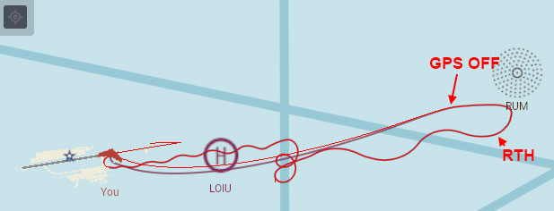
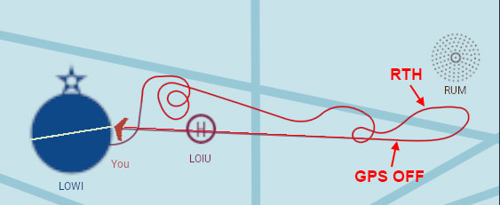
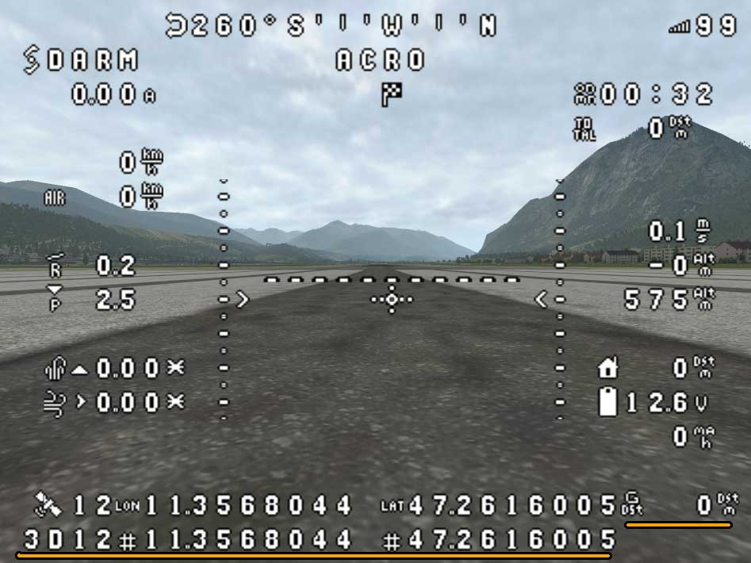

# Опис

Відео демонстрація:

[](https://www.youtube.com/watch?v=MiOdIXQ3F5w)

На цьому ресурсі викладено модифіковану прошивку INAV 6.0 з можливістю навігаціі за умов **тимчасової** відсутності GPS.
Працює лише на літаках.
Основна мета модифікації - **повернення літака домому в умовах втрати сигналів керування та GPS**.


Літак повинен бути обладнаний датчиками:
- **акселерометр, гіроскоп**
- **барометр**
- **GPS**
- **компас**
- *трубка піто* (не обов'язково)


Наявна прошивка INAV **відключає всі навігаційні режими** при втраті GPS сигналу. При польотах над недоступною місцевістю, втрата сигналу керування означає втрату літака, оскільки літак може лише або продовжувати безконтрольно летіти, або приземлитися.

Модифікована прошивка дозволяє повернути літак, вікористовуючи лише компас і барометр.

Треба наголосити, що прошивка **не є рішенням для виконання місій в умовах повної відсутності GPS**. Якщо повернення додому з похибкою +-2км для відновлення сигналу керування є нормальним, то виконання місій з такою похибкою навряд чи є доцільним.

В реальних умовах похибка складає до 200м на 1 км шляху. 


# Завантаження

### Версія: 1.2

Прошивку можна завантажити тут https://github.com/RomanLut/inav/tree/6.0.0_gps_fix_estimation/firmware

або самостійно зібрати з branch https://github.com/RomanLut/inav/tree/6.0.0_gps_fix_estimation


### Історія змін

* **1.2 ======**
 
    - Естимація вітру вважається достовірною, якщо перераховувалась не більше 30 хвилин тому (було: не більше 15 хвилин тому)
    
    - Остання відома сила вітру вікористовується впродовж всього польоту з GPS Fix estimation (було: не більше 15 хвилин)
    
    - Покращено дотримання курсу в режимі GPS Fix estimation під впливом бокового вітру
     
    
Одне з нововведень inav 6.0 - дотримання лініі маршруту, а не просто постійне повертання носу на цільову точку.

В версіі 1.2 воно праціє і для GPS Fix estimation.

Дотримання курсу, GPS Fix estimation, вітер з півночі, версія 1.1:
    


Дотримання курсу, GPS Fix estimation, вітер з півночі, версія 1.2:
    

    
    
* **1.1 ======** 
 
    - Додано відображення супутників та координат з GPS сенсора
    
    
* **1.0 ======** 
 
    - Перша робоча версія на основі INAV 6.0


# Як це працює ?

За нормальних умов, літак отримує своє положення від датчика GPS, що надає йому можливість здійснювати навігацію згідно маршруту.

За відсутності GPS, літак має інформацію лише про напрямок польоту (від компасу).

Припустивши, що в навігаційних режимах літак рухається з постійною відомою швидкістю, є можливість вираховувати нові координати, використовуючи останні відомі координати, напрямок і швидкість (так званий метод навігації "dead reconing").

Але така навігація не є точною. З часом накопичується істотна похибка. 

Припускається, що літак почне повернення з деяким відхиленням від курсу, після чого сигнали GPS або керування відновляться.

*Первинно літак повинен отримати GPS fix і запям'ятати точку повернення. Тобто зліт в умовах повної відсутності GPS неможливий.*

# Налаштування

Включення навігації без GPS виконується командою CLI:

```set inav_allow_gps_fix_estimation=ON```

Якщо не встановлена трубка Піто, то дуже важливо якомога точніше вказати швидкісь літака в режимі CRUZ. Для цього потрібно вивести швидкість на OSD і здійснити тестовий політ. Щоб мінімізувати вплив вітру, потрібно здійснити польоти в протилежних напрямках і вирахувати середнє.

Швидкіть потрібно вказати в см/с. 

Щоб перевести з км/г до см/с, потрібно домножити на 27.77.

Наприклад, 100 км/г = 100 * 27.77 = 2777 см/с

```set fw_reference_airspeed=2777```

*Важливо, щоб в умовах втрати GPS літак летів з вказаною швидкістю. Якщо у вас налаштовано збільшення Cruise Throttle за допомогою стіку, не використовуйте це в моменти відсутності GPS.*

*Але якщо встановлена трубка піто, швидкість буде вираховуватись з даних від трубки піто. Точність навігації підвищиться. Також можна використовувати Cruise throttle override без зниження точності*.

Якщо є потреба виконувати місії без сигналу керування, вводимо:

```set failsafe_mission_delay=-1```

**Після введення команд, важливо зберегти налаштування командою:**

```save```

# Відключення датчика GPS з пульта керування

 

Ця можливість може використовуватись:
- для тестування навігації без GPS
- для навмисного відключення GPS в умовах GPS спуфінгу

*Відключення працює після того, я літак знайде супутники і зафіксує точку повернення, і лише в режимі ARM.*

*Важливо: якщо GPS координати вже спотворені GPS спуфінгом, неможна використовувати автоматичне повернення додому. Відключення треба робити заздалегіть. При спотворенні GPS координат потрібно вийти з зони спуфінгу на ручному керуванні, отримати правильний GPS fix, і лише після цього використовувати RTH. Після спотворення, відключення має сенс робити тільки для нейтралізації негативного впливу спотворення (спуфінг впливає на навігаційні режими і утримання висоти). Але при цьому є ризик втратити сигнал керування, і втратити літак, який буде повертатись в невідомому напрямку, використовуючи останні спотворені координати.*

# Відображення координат з сенсора GPS

В версіі 1.1 додано відображення:
- кількості супутників з сенсора GPS
- координат з сенсора GPS
- різніці координат. Відстань між координатами = похибка естимації

Очевидно, що це працює, коли сенсор GPS отримує координати, але примусово відключений за допомогою **GPS OFF Box**.

Кількість супутників, координати **LAT** та **LON** (не + кодування) відображаються в наступному рядку відносно нормального елементу. Тобто індикатори потрібно розмістити таким чином, щоб у наступному рядку було вільне місце.

Замість індикатора **Glide Distance** відображається різниця координат. Таким чином, відключивши GPS сенсор, є можливість спостерігати накопичення помилки естимації
*(А якщо помилка різко зросла до декількох кілометрів - GPS сенсор приймає спотворені координати (spoofing))*

*Телеметрія та Blackbox отримують естимовані координати. Коли працює естимація - кількість супутників = 99.*




# Що містить ця модифікація ?

- INAV 6.0 release
- підтримку симулятора https://github.com/RomanLut/INAV-X-Plane-HITL
- можливість навігаціі за умов тимчасової відсутності GPS
- можливість відключати GPS з пульта керування
- відображення координат і кількості супутників з відключеного сенсору GPS, відображення помилки естимації координат на OSD


# Навіщо це потрібно, Ardupilot давно так може?

Так, і рекомендується використовувати пошивку Ardupilot, яка набагато більше розвинена. Але не всі польотні контролери підтримують Ardupilot. Ця прошивка рекомендується для літаків, які наразі використовують INAV. У будь-якому випадку, краще мати якісь шанси врятувати літак, ніж ніяких.

# Чи є подібне рішення для квадкоптерів ?

Начасі нажаль немає.

# Фізичне розташування компасу

Майте на увазі, что компас повинен бути точно направлений у напрямку носу літака. Помилка на 5 градусів дає помилку 87м на кілометр шляху.

# Помилки сенсорів

Навігація без GPS fix можлива лише за умов стабільної роботи сенсорів GPS, Compass та Baro. Сенсор GPS повинен працювати і рапортувати 0 супутників, а не зависати через проблеми з залізом. Прошивка не вирішує проблеми "відпадаючих" сенсорів через завади по живленню!

# Iншi налаштування

## nav_rth_abort_threshold
Рекомендується відключити ```nav_rth_abort_threshold```, щоб виключити Emergency landing при спуфінгу GPS. Інакше літак може включити Emergency landing під час RTH, якщо спуфінг різко змінив координати.

```set nav_rth_abort_threshold = 0```

## nav_disarm_on_landing

Рекомендується відключити ```nav_disarm_on_landing```, щоб виключити Disarm on landing при спуфінгу GPS. Інакше літак може задізармитись в Failsafe mode, якщо спуфінг "заморозив" координати.

```set nav_disarm_on_landing= off```


# Links

INAV HITL, симулятор https://github.com/RomanLut/INAV-X-Plane-HITL

Аннлогічна прошивка на основі INAV 5.0 https://github.com/RomanLut/inav/blob/5.0.0_gps_fix_estimation/docs/gps_fix_estimation.md
